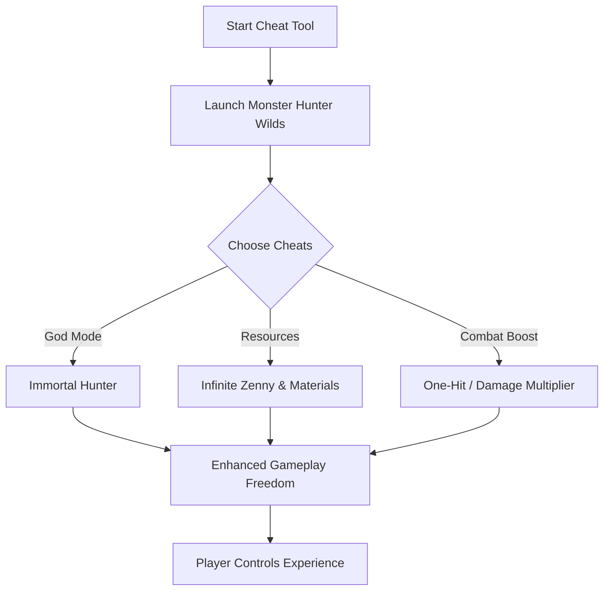

# Monster Hunter Wilds Cheat Tool 🐉

Monster Hunter Wilds pushes the franchise into massive open zones filled with colossal monsters and endless crafting. For players who want to skip the grind or test extreme builds, the **Monster Hunter Wilds Cheat Tool** provides advanced controls to reshape the game at your fingertips.

---

## 🔎 Overview

Unlike basic trainers, this cheat tool is built with **modular toggles and real-time adjustments**. Whether you want **infinite zenny**, max crafting materials, or instant monster takedowns, the software lets you tailor the experience to your preference.

It’s not just about making the game easier — it’s about exploring **every aspect of Monster Hunter Wilds** without restrictions.

---

## ✨ Key Features

* **Infinite Resources** – Max out zenny, crafting parts, and upgrade materials.
* **God Mode** – Hunt without worrying about fainting.
* **One-Hit Kill** – Instantly slay monsters for fast farming.
* **Damage Multiplier** – Fine-tune attack power (x2 to x50).
* **Instant Crafting** – Unlock any weapon or armor without material limits.
* **Speed Hack** – Move across vast zones faster than ever.
* **Custom Hotkeys** – Map cheats to keys for seamless hunting.

[!IMPORTANT]
The tool is strictly for **single-player and offline use**. Using it online may disrupt balance or trigger bans.

---

## 🖥 Compatibility

| Platform          | Supported Versions | Notes                             |
| ----------------- | ------------------ | --------------------------------- |
| **Windows 10/11** | ✅ Yes              | Full compatibility with PC builds |
| **Steam Deck**    | ⚠️ Partial         | Requires Proton/Wine tweaks       |
| **Consoles**      | ❌ No               | Not supported                     |

[!NOTE] Works best with the **Steam release of Monster Hunter Wilds**.

---

## ⚡ Setup & Usage

1. **Download** the verified cheat tool build.
2. **Extract** into a separate folder from the game.
3. **Run** the cheat software as Administrator.
4. Launch **Monster Hunter Wilds**.
5. Toggle cheats using hotkeys (default: `F1–F8`).

Sample config:

```ini
[CheatSettings]
GodMode=True
OneHitKill=False
DamageMultiplier=5
InfiniteZenny=True
InstantCrafting=True
Speed=1.5
```

---

## 🕹 Gameplay Flow with Cheats



---

## ❓ FAQ

**Q: Will this tool unlock all armor instantly?**
A: Yes — using Instant Crafting, you can build any set without farming materials.

**Q: Can I toggle cheats mid-hunt?**
A: Absolutely. Hotkeys let you activate or deactivate features instantly.

**Q: Is this compatible with multiplayer hunts?**
A: No — this tool is designed only for solo or offline play.

**Q: Does it break future updates?**
A: Regular updates keep it functional after patches. Always download the latest build.

**Q: Will it affect monster AI?**
A: No, AI remains intact — you simply change how your hunter interacts with the world.

---

## 🚀 Final Thoughts

The **Monster Hunter Wilds Cheat Tool** is the fastest way to unlock the full potential of the game. From experimenting with wild builds to farming monsters in seconds, it transforms how you play and gives you full freedom over progression.

---
